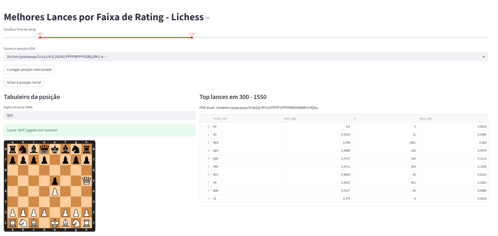

# Melhores Lances de Xadrez por Faixa de Rating ♟️
Em construção...

Este projeto é uma ferramenta para analisar e visualizar os melhores lances de xadrez em diferentes posições, particionando pelo nível de rating (ELO) dos jogadores do Lichess, com o intuito de não só analisar as melhores jogadas objetivamente falando (e.g. pela análise do Stockfish), mas também as melhores jogadas em termos práticos (i.e. aquelas que funcionam para jogadores de um dado nível). Ele processa jogos em massa de forma eficiente usando DuckDB e fornece uma interface interativa com Streamlit.

## O Objetivo de Negócio
Engines de xadrez como o Stockfish avaliam posições com precisão muito superior à de qualquer humano (incluindo Grandes Mestres), tornando algumas linhas teoricamente ótimas, mas improváveis para jogadores amadores.  
Este projeto analisa estatisticamente os jogos de Lichess, mostrando:
- **Taxa de vitórias (win_rate)**
- **Frequência de jogadas (play_rate)**
por faixa de ELO, permitindo identificar as melhores jogadas *práticas* em cada posição.

### Limitações da abordagem:
- O número de posições possíveis no xadrez é astronômico.  
- Mesmo usando grandes amostras de jogos, não é possível ter estatísticas confiáveis para todas as posições.  
- O projeto processa apenas uma amostra limitada por questões computacionais. 

## 🚀 Funcionalidades
Processamento de Dados: Extrai dados de lances de arquivos .pgn.zst e os salva em um banco de dados DuckDB otimizado.

Análise Dinâmica: Consulta e classifica os melhores lances de acordo com a taxa de vitórias (win_rate) e volume de amostras (n).

Dashboard Interativo: A interface Streamlit permite explorar o tabuleiro, fazer movimentos e filtrar a análise por uma faixa de rating personalizada usando um slider.

## Como Usar
### 1. Requisitos
O projeto usa o gerenciador de pacotes Poetry.

Instale as dependências:

poetry install

### 2. Obtenha os dados:

Baixe um ou mais arquivos de jogos (e.g. programático no download_bulk_games.sh) .pgn.zst do Lichess database (https://database.lichess.org/#standard_games). 

Coloque-o na pasta data/.

### 3. Processar os dados
Este passo cria o banco de dados melhores_lances.duckdb a partir do arquivo .pgn.zst.

poetry run python -m src/process_bulk_games.py

### 4. Iniciar a aplicação
Depois de processar os dados, inicie o dashboard Streamlit:

poetry run python -m streamlit run src/dashboard.py

O dashboard estará disponível em seu navegador.

## Ideias futuras
Ponderar avaliação do Stockfish pela probabilidade do jogador de ELO X escolher tal jogada

Analisar aberturas objetivamente ruins, mas com bom desempenho prático (ex: Gambito Englund), comparando avaliação vs. probabilidade de vitória.